<p align="center">
  
</p>

<p align="center">
  <strong>Charset detection that stays fast, honest, and dependency-free.</strong><br>
</p>

<p align="center">
  <a href="https://pypi.org/project/bytesense/">
    
  </a>
  <a href="https://pypi.org/project/bytesense/">
    
  </a>
  <a href="https://github.com/oguzhankir/bytesense/actions/workflows/ci.yml">
    
  </a>
  <a href="https://codecov.io/gh/oguzhankir/bytesense">
    
  </a>
  <a href="LICENSE">
    
  </a>
</p>

<p align="center">
  <sub>Author: <strong>Oğuzhan Kır</strong> · <a href="https://github.com/oguzhankir/bytesense">GitHub</a> · <a href="docs/">Docs</a></sub>
</p>

---

**bytesense** reads raw bytes and tells you which encoding likely produced them—without shipping neural nets, without pulling in other Python packages at install time, and with an explainable `why` on every result. It is designed as a modern alternative to **chardet** and **charset-normalizer** for teams that want predictable performance and a small install footprint.

If you already use `chardet.detect()` or `charset_normalizer.detect()`, you can swap in `bytesense.detect()` with minimal code churn.

## Comparison with chardet & charset-normalizer

Same idea as the [charset-normalizer README](https://github.com/Ousret/charset_normalizer): a **feature matrix** and **measured** accuracy on the bundled suites, so you can see where bytesense stands—not hand-wavy marketing.

### Feature matrix

| Feature | [Chardet](https://github.com/chardet/chardet) | [Charset Normalizer](https://github.com/Ousret/charset_normalizer) | **bytesense** |
|---------|:---:|:---:|:---:|
| Fast | ✅ | ✅ | ✅ |
| Universal¹ | ❌ | ✅ | ✅ |
| Reliable without distinguishable standards | ✅ | ✅ | ✅ |
| Reliable with distinguishable standards | ✅ | ✅ | ✅ |
| License | MIT | MIT | MIT |
| Native Python (no C extension required) | ✅ | ✅ | ✅ |
| Optional native acceleration | — | — | Rust (`pip install "bytesense[fast]"`) |
| Detect spoken language | ✅ | ✅ | ✅ |
| Explainable detection (`why`) | Partial | Rich metadata | **Yes** (always) |
| Streaming-first API | Limited | Via API patterns | **`StreamDetector`** |
| Wheel size (typical) | ~500 kB | ~150 kB | Small (pure Python + tables) |
| Custom codecs via stdlib registration | ❌ | ✅ | ✅ (same `codecs` model) |

¹ *Universal* in the charset-normalizer sense: coverage follows **what your Python build exposes through `codecs`** as decode candidates—not a fixed “99 encodings” count on every platform.

### Accuracy (bundled tests, three-way)

Numbers below are from the same **`./scripts/compare_libraries.sh`** run the CI exercises: **chardet**, **charset-normalizer**, and **bytesense** on identical inputs. **Strict** = detected codec name matches the reference (after `codecs.lookup` aliases). **Functional** = decoded Unicode matches the reference encoding (multiple labels can count if they decode to the same text—same spirit as charset-normalizer’s comparisons).

**39-case suite** (synthetic + charset-normalizer’s published `data/` samples, expected labels aligned with their tests):

| Package | Strict | Functional |
|---------|--------|------------|
| **bytesense** | **100%** (39/39) | **100%** (39/39) |
| charset-normalizer | 92.3% (36/39) | 97.4% (38/39) |
| chardet | 79.5% (31/39) | 97.4% (38/39) |

**24-case hard stress** (paragraph-sized, ambiguous SBCS / CJK / UTF-16 / ISO-2022 — `benchmarks/test_hard_scenarios.py`):

| Package | Strict | Functional |
|---------|--------|------------|
| **bytesense** | **83.3%** (20/24) | **100%** (24/24) |
| charset-normalizer | 41.7% (10/24) | 58.3% (14/24) |
| chardet | 70.8% (17/24) | 91.7% (22/24) |

*Updated March 2026 — CPython 3.12, chardet 7.x, charset-normalizer 3.4.x, bytesense 0.1.0. Your CPU and dependency versions will differ; re-run `./scripts/compare_libraries.sh` to refresh.*

### Speed (pytest-benchmark, same machine snapshot)

Rough single-thread means (`pytest benchmarks/test_bench_detection.py`, speed filter; **your numbers will differ**):

| Sample (`from_bytes` / `detect`) | bytesense | chardet |
|----------------------------------|-----------|---------|
| `utf8_bom` | ~4 µs | ~104 µs |
| `utf8_ascii_only` | ~46 µs | ~114 µs |

UTF-8 with BOM is an early exit in bytesense; chardet still runs its full probe. Profile your own payloads.

### How to reproduce

```bash
pip install -e ".[dev]"
python scripts/build_fingerprints.py
python scripts/fetch_cn_benchmark_samples.py   # CN `data/` mirrors into benchmarks/data/cn_official/
./scripts/compare_libraries.sh                   # prints the tables above (accuracy + hard stress)
```

Options: `./scripts/compare_libraries.sh --no-fetch` (no download), `--no-hard` (skip 24-case stress). Full benches: `./scripts/run_all_benchmarks.sh`.

**Fingerprint script:** Lines like `utf_16` “skipped” are normal — UTF-16/32 are handled via BOM / null-byte rules, not the single-byte histogram table.

**Troubleshooting `fetch_cn_benchmark_samples.py` (SSL on macOS):** Use `.venv/bin/python scripts/...`. `certifi` is in `[dev]`. If HTTPS still fails: *Install Certificates.command* for your Python, or `python scripts/fetch_cn_benchmark_samples.py --insecure` as a last resort.

## Installation

```bash
pip install bytesense                 # pure Python — always works
pip install "bytesense[fast]"       # same API; uses Rust wheel when available for your platform
```

**Test PyPI** (pre-release smoke test): after publishing to [test.pypi.org](https://test.pypi.org/), install with an extra index so pip can fetch build tools from PyPI:

```bash
pip install --index-url https://test.pypi.org/simple/ --extra-index-url https://pypi.org/simple/ bytesense
```

## CLI

`bytesense` ships with a small CLI for files on disk.

```text
usage: bytesense [-h] [-v] [-m] [--version] FILE [FILE ...]

positional arguments:
  FILE              File(s) to analyse

optional arguments:
  -h, --help        show this help and exit
  -v, --verbose     Include the ``why`` field in JSON (``confidence_interval`` is always shown)
  -m, --minimal     Print only the detected encoding name
  --version         Show version and exit
```

```bash
bytesense ./README.md
bytesense -m ./README.md
python -m bytesense.cli --version
```

`stdout` is JSON (one object per file, or a list when multiple files and not `-m`):

```json
{
  "encoding": "utf_8",
  "confidence": 0.98,
  "confidence_interval": [0.93, 1.0],
  "language": "English",
  "alternatives": [],
  "bom_detected": false,
  "chaos": 0.02,
  "coherence": 0.41,
  "byte_count": 2048,
  "path": "/absolute/path/to/file"
}
```

Use ``-v`` to add the human-readable ``why`` string to each object.

## Python

**Full result object**

```python
from bytesense import from_bytes, from_path

result = from_path("notes.txt")
print(result.encoding, result.confidence, result.language)
print(result.why)
```

**Streaming**

```python
from bytesense import StreamDetector

det = StreamDetector()
for chunk in response.iter_content(1024):
    det.feed(chunk)
    if det.confidence >= 0.99:
        break
print(det.encoding, det.language)
```

## Repair mojibake

```python
from bytesense import repair

garbled = "été"   # UTF-8 read as Latin-1
result = repair(garbled)
if result.improved:
    print(result.repaired)    # "été"
    print(result.chain)       # ("latin_1", "utf_8")
    print(result.improvement) # e.g. 0.34
```

## Stream from HTTP

```python
from bytesense import detect_stream
import urllib.request

with urllib.request.urlopen("https://example.com") as resp:
    result = detect_stream(
        iter(lambda: resp.read(1024), b""),
        stop_confidence=0.99,
    )
print(result.encoding)
```

## HTML/XML hints

```python
from bytesense import best_hint, from_bytes

html = b'<meta charset="cp1252"><p>Hëllo</p>'
hint = best_hint(html, headers={"Content-Type": "text/html"})
result = from_bytes(html)
print(hint, result.encoding)
```

## Multi-encoding documents

```python
from bytesense import detect_multi

# Example: bytes from a legacy .eml or mixed scrape
your_bytes = b"..."  # replace with your document
result = detect_multi(your_bytes)
print(f"Uniform encoding: {result.is_uniform}")
for seg in result.segments:
    print(f"  [{seg.start}:{seg.end}] {seg.encoding} — {seg.text[:40]!r}")
```

**Drop-in `detect()`**

```python
from bytesense import detect

print(detect(b"hello"))  # {"encoding", "confidence", "language"}
```

More detail: [docs/api.md](docs/api.md) · [docs/quickstart.md](docs/quickstart.md)

## Why bytesense

- **Decode as late as possible.** Histograms, BOMs, and null-byte layout often rule out whole families of encodings before you spend CPU on full decodes.
- **Shortlist, then verify.** Cosine similarity against pre-generated fingerprints (see `scripts/build_fingerprints.py`) keeps the expensive “mess + coherence” phase on a handful of candidates.
- **No black boxes.** No training step, no weights to tune, no network calls—just tables and statistics you can inspect.
- **Rust is optional.** `pip install bytesense` never requires a compiler; Rust only accelerates hot paths when a wheel matches your platform.

## How it works (short)

1. **Fingerprint** the byte distribution and compare to pre-computed vectors.
2. **Decode** only the shortlisted encodings (strict), in a controlled order.
3. **Mess** — score how “garbled” the decoded text looks (printable ratio, bigrams, etc.).
4. **Coherence** — score language plausibility using character-frequency priors.
5. **Rank** and return the best hypothesis plus a human-readable **why**.

## Known limitations

- Very short inputs (dozens of bytes) are inherently ambiguous; any detector will guess.
- Mixed-language text can confuse language coherence.
- Like any heuristic detector, adversarial or random binary data may yield a best-effort encoding with low confidence.

## Contributing

Issues and PRs are welcome: [CONTRIBUTING.md](CONTRIBUTING.md) · [Issues](https://github.com/oguzhankir/bytesense/issues)

## License

MIT — see [LICENSE](LICENSE).

Copyright © Oğuzhan Kır.
